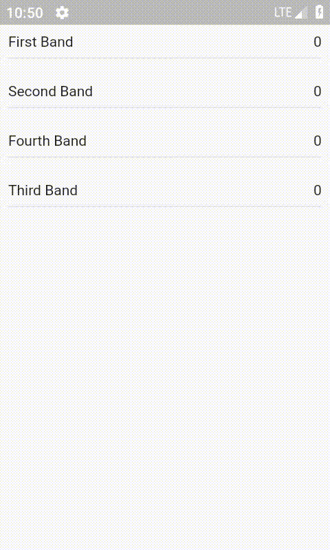

# backend_flutter

A new Flutter application.

This is mainly a code application instead of UI
application. Firestore is used as the back-end for the project. Transactions are used to avoid race conditions.

User can tap on the band name to vote for their favorite Band. 

This project uses Firestore as backend and Flutter for the UI work.
